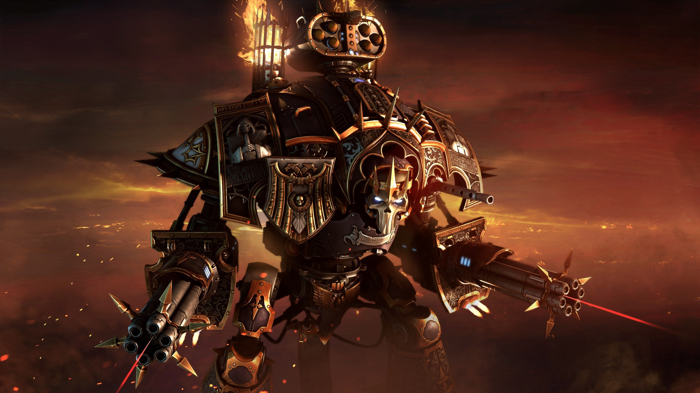

# Omarchy Grimdark Solarized Theme

Warhammer 40k inspired Solarized Dark theme for Omarchy Linux. This is a grim, low-noise take on Solarized that keeps the palette faithful while pushing the atmosphere toward gothic sci-fi, with custom Waybar, Walker, and SwayOSD styling plus a hand-picked set of free 4k Warhammer 40k wallpapers. Built for Omarchy's theme installer, this repo ships all configs and assets needed to apply the look in one go.

## What's included

- Hyprland: dimmed inactive windows, zero borders, custom opacity rules (`hyprland.conf`)
- Hyprlock colors for ring and text (`hyprlock.conf`)
- Waybar styling with a custom grimdark layout (`waybar.css`)
- Terminals: Alacritty (`alacritty.toml`), Ghostty (`ghostty.conf`), Kitty (`kitty.conf`)
- Shell/UI tools: btop (`btop.theme`), Wofi (`wofi.css`)
- Notifications and helpers: Mako (`mako.ini`), SwayOSD (`swayosd.css`), Walker launcher (`walker.css`)
- Neovim colorscheme snippet (`neovim.lua`)
- Icon theme pointer for Yaru-purple (`icons.theme`)

## Quick start

Run the installer and it will place everything where it belongs:

```
omarchy-theme-install https://github.com/OldJobobo/omarchy-grimdark-solarized-theme
```

Wallpapers live in `backgrounds/`. Apply them in your wallpaper tool of choice after installation.

## Customize

- Tweak window opacity in `hyprland.conf` if you want more or less dimming.
- Adjust bar spacing, fonts, and modules in `waybar.css` to fit your layout.
- Swap terminal presets by editing `alacritty.toml`, `ghostty.conf`, or `kitty.conf` before installing.

## Background previews

<table>
  <tr>
    <td align="center">
      <br>
      Battlefield Melee Ruckus
    </td>
    <td align="center">
      <br>
      Chaos War Red Moon
    </td>
    <td align="center">
      <br>
      City Siege Firestorm
    </td>
  </tr>
  <tr>
    <td align="center">
      <br>
      Cliff Approach Gothic City
    </td>
    <td align="center">
      <br>
      Knight Titan Sunset
    </td>
    <td align="center">
      <br>
      Ruined Cathedral Blue Assault
    </td>
  </tr>
  <tr>
    <td align="center">
      <br>
      Techmarine Sanctum
    </td>
    <td align="center">
      <br>
      Tyranids Encircle Marine
    </td>
    <td align="center">
      <br>
      Ultramarine Hero Battlefield
    </td>
  </tr>
</table>

## Notes

- Hyprland rules enforce full opacity on active windows and slight dimming on inactive ones; adjust `windowrule` lines if you want different defaults.
- The palette is Solarized Dark at its core, tuned toward grimdark contrast and saturation control for a Warhammer 40k feel.
